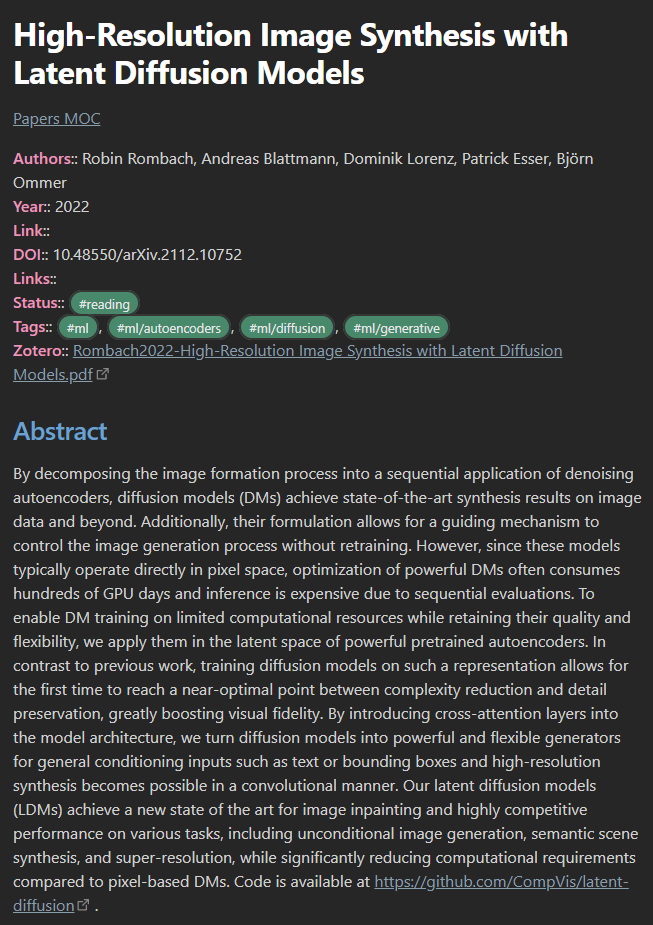

# technical-obsidian-template
Base template for creating a vault for technical/scientific notes. It includes specific formatting, and specific use cases,
as well as examples for Temaples, and dataviews:

## Install

* Download [Obsidian](https://obsidian.md/)
* Clone the repository `git clone https://github.com/kobbled/technical-obsidian-template`
* Open the **technical-template** folder in obsidian as a new vault.
* Enable Community plugins

## Features

* **Card Example**

* **Zotero Import**

* **Image Grids**

* **Slideshow**

