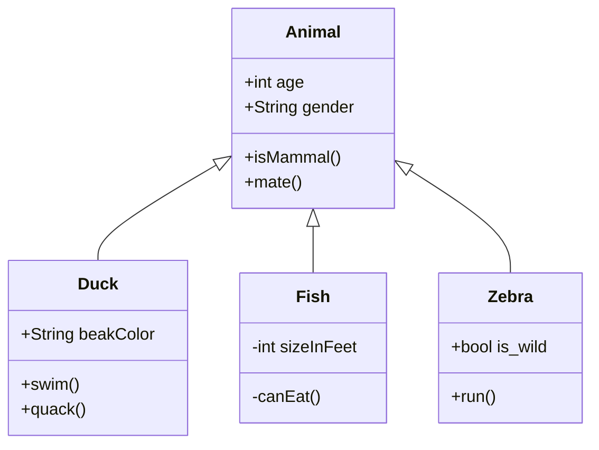

 #main #entry

-----------------
## H2
### H3
#### H4
##### H5

## Images

Single images with be centered:

![[NF39C8NW.png|600]]

### Image Grid Test

Sequential images that are not seperated by a space will be put into a tile grid.

![[sunset.png]]

![[car.png]]
![[overpass.png]]
![[parkbench.png]]

---------------------

![[draw_wizard.png]]
![[draw_space.png]]

![[draw_sunset.png]]

## Quotes

> **General Block**
> This is a general quote block. Change the theming in CSS snippet `minimal_theme_mods`

> [!info]
> This is a generic callout

## Charts

