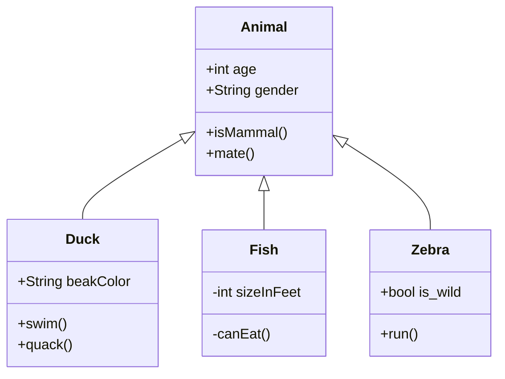

 #main #entry

-----------------
## H2
### H3
#### H4
##### H5

## Images

Single images with be centered:

![[NF39C8NW.png|600]]

### Image Grid Test

Sequential images that are not seperated by a space will be put into a tile grid.

![[sunset.png]]

![[car.png]]
![[overpass.png]]
![[parkbench.png]]

---------------------

![[draw_wizard.png]]
![[draw_space.png]]

![[draw_sunset.png]]

### Image Slideshow

>[!note]
>Currently there is no internal support for image carousels/slideshows. You will have to use pure **HTML**/**CSS** to get this to work.

Credit to [Wojciech Maj](https://stackoverflow.com/questions/30295085/how-can-i-make-an-image-carousel-with-only-css)

>[!tip]
>View in source mode to see **HTML** for adding/changing images!

    

        <input type="radio" name="css3slideshow" id="slide1" checked /><!--
     --><label for="slide1"></label><!--
     --><input type="radio" name="css3slideshow" id="slide2" /><!--
     --><label for="slide2"></label><!--
     --><input type="radio" name="css3slideshow" id="slide3" /><!--
     --><label for="slide3"></label><!--
     --><input type="radio" name="css3slideshow" id="slide4" /><!--
     --><label for="slide4"></label><!--
     --><input type="radio" name="css3slideshow" id="slide5" /><!--
     --><label for="slide5"></label> 
    

## Quotes

> **General Block**
> This is a general quote block. Change the theming in CSS snippet `minimal_theme_mods`

> [!info]
> This is a generic callout

## Charts

