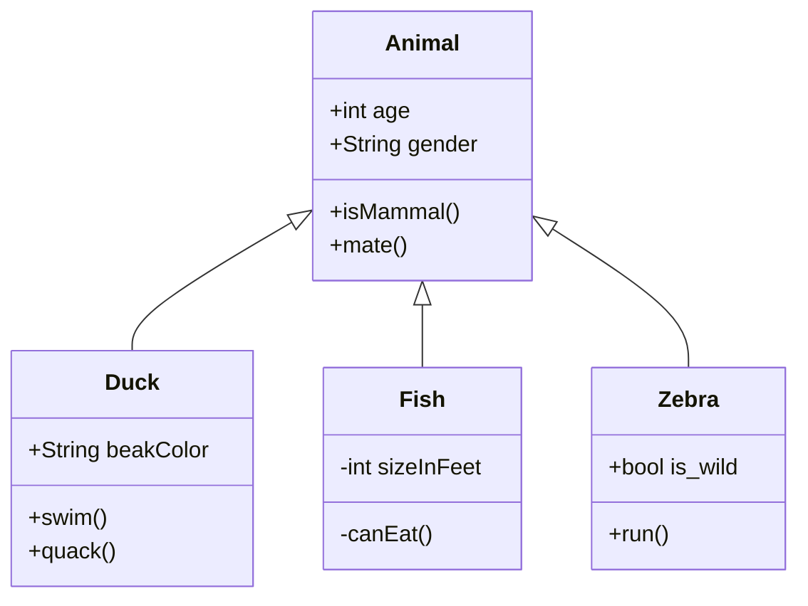

 #main #entry

-----------------
## H2
### H3
#### H4
##### H5

## Modular Layout

Modular layout CSS can be found, and installed from [here](https://github.com/efemkay/obsidian-modular-css-layout)

**Examples**:
* [[Image Gallery]]
* [[List Cards]]
* [[Multi Column Callout]]
* [[Text Justify]]

## Images

Single images with be centered:

![[NF39C8NW.png]]

### Image Grid Test

Sequential images that are not seperated by a space will be put into a tile grid.

![[sunset.png]]

![[car.png]]
![[overpass.png]]
![[parkbench.png]]

---------------------

![[draw_wizard.png]]
![[draw_space.png]]

![[draw_sunset.png]]

### Image Slideshow

[[Image Slideshow]]

## Charts

## Dataview

* [[Movie Database]]